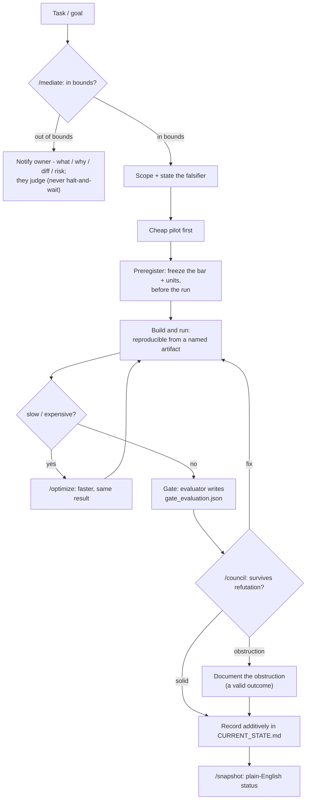
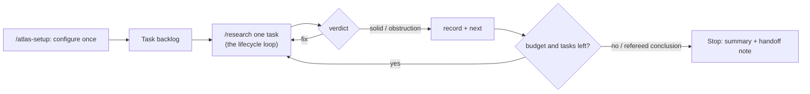

```text
    \ __ __| |        \     ___|
   _ \   |   |       _ \  \___ \
  ___ \  |   |      ___ \       |
_/    _\_|  _____|_/    _\_____/

  Auditable Trails for Long Autonomous Sessions.
```

# Atlas

A documented command surface for **rigorous, agent-assisted research *and* development** - a hub
that maps and governs many concurrent repos/work areas, where a result (or a change) only counts
after it survives an attempt to break it. It encodes a working method into files an AI coding agent
(e.g. Claude Code) and a human can both operate: a living operating guide, a canonical state
surface, ownership/coordination across workstreams, preregistration + verification gates,
adversarial review, and a typed memory of lessons learned.

The same loop serves a science program (preregister → run → gate → review → record) and a software
program (spec → build → test/verify → review → record): pre-state the bar, verify adversarially,
record additively. It ships with a **runnable demo** (`experiments/exp0_demo`, numpy-only, runs in
seconds) that walks the whole lifecycle end to end - including a planted overclaim caught in review
and walked back - so you can see it work before adopting it.

> Distilled from the working practice of the **Curv Institute** program and generalized for reuse.
> See `OPERATING_GUIDE.md` for the method and `CONTRIBUTING.md` for the discipline.

## The idea in one sentence
Rather be right than impressive: lead with the instrument, pre-state the threshold, verify
adversarially, and record everything additively - withdrawals stay on the page.

## How the workflows compose
Each named workflow is a skill (`/mediate`, `/research`, `/optimize`, `/council`, `/snapshot`).
`/research` drives the whole loop; `/atlas-setup` (alias `/onboard`) configures the repo first.



## Built for long, bounded autonomous runs
Atlas is designed for work you hand to an agent and walk away from - long, unsupervised sessions
that must stay honest and *stop on their own*. It bounds autonomy with structure, not trust:

- **Pre-stated bars + gates** - the agent can't move the goalposts; the verdict comes from an
  evaluator against a frozen, unit-bearing threshold.
- **Ownership mediation, not halting** - `/mediate` routes out-of-bounds work to its owner instead of
  stalling the whole run on a human, so progress continues on what the agent owns.
- **Resumable** - `CURRENT_STATE.md` + a task ledger let a run pause, summarize, and be picked up
  later (or by a different agent).
- **Additive, auditable record** - every result *and* withdrawal stays on the page, so a long
  unsupervised run leaves a trail you can verify after the fact.
- **Interruptions ≠ conclusions** - an API/tooling error is logged and resumed, never counted as a
  result or a reason to quit; only a real positive or a fully-surveyed conclusion stops a loop.



## Works with CLI agents
The agent rules live in a root **`AGENTS.md`** (an emerging cross-agent convention read natively by
Codex and opencode). Claude Code, Gemini CLI, and Cursor are pointed at it by thin redirects
(`CLAUDE.md`, `GEMINI.md`, `.cursor/rules/`), so each loads the same method. The workflows are
plain-markdown procedures under `.claude/skills/<name>/SKILL.md` that any agent can be pointed at and
follow; native auto-discovery and slash-command invocation are Claude-Code-only. Verified end-to-end
on a fresh clone with both Codex and Claude (the demo reproduced bit-for-bit).

**New here?** Run **`/atlas-setup`** (alias `/onboard`) - a guided wizard that walks you through
naming, ownership, which agents you use, the optional fleet layer, and your first experiment.

## What's here
| Path | What it is |
|------|------------|
| `AGENTS.md` | **Canonical agent entry point** (any CLI agent). The rest redirect here. |
| `OPERATING_GUIDE.md` | The method: result lifecycle, claim hygiene, confound catalog, pre-claim checklist, amendment protocol. **Living document.** |
| `CURRENT_STATE.md` | The single canonical state surface: live claims, the **withdrawn-claims register**, adoptions/closures. |
| `Home.md` | Index of every topic/wiki page. |
| `OWNERSHIP.md` | Who/what owns which area - consulted by the `/mediate` skill. |
| `REPOS.md` | The repos this hub governs; register a checkout with `/add-repo <path>`. |
| `.claude/skills/` | Agent workflows: `/atlas-setup` (`/onboard`), `/add-repo`, `/research`, `/council`, `/optimize`, `/snapshot`, `/mediate`. |
| `wiki/topics/` | Hand-edited topic pages (no build pipeline; the files *are* the wiki). |
| `experiments/exp0_demo/` | A runnable toy that exercises the full lifecycle. |
| `memory/` | Typed, persistent lessons (`user` / `feedback` / `project` / `reference`) + index. |
| `fleet/` | *Optional* multi-machine layer: a sanitized inventory + infra discovery discipline. |
| `STYLE.md` + `tools/style-check.sh` | "No AI tells" style rules + a lint gate that bans them. |

## Quick start
```bash
# 1. See the method work end to end (needs `uv`: https://docs.astral.sh/uv/)
cd experiments/exp0_demo
uv run pilot/run.py --out raw.json          # deterministic; writes raw results + a content hash
uv run gate.py --raw raw.json --out gate_evaluation.json   # evaluates pre-stated thresholds → PASS/FAIL
cat RESULTS_demo.md                          # the verdict, and the worked overclaim→walkback

# 2. Adopt it for your own work
#    - rename the repo; empty CURRENT_STATE.md to your starting state
#    - write your first PREREGISTRATION.md before you run anything
#    - drive it with an agent: open in Claude Code and run /research on your task list
```

## How to adopt (5 steps)
1. **Fork & rename.** Replace this README's specifics; keep `OPERATING_GUIDE.md` and the skills.
2. **Seed `CURRENT_STATE.md`** with what you currently believe and what's still open.
3. **Preregister before running.** Copy `experiments/exp0_demo/PREREGISTRATION.md` as your template; freeze it (commit, optionally OpenTimestamp) *before* collecting data.
4. **Gate, then review.** Run your evaluator to a `gate_evaluation.json`; then run `/council` to try to refute the result before you write it down as a claim.
5. **Record additively.** Wins and withdrawals both stay in `CURRENT_STATE.md`. Never delete history; supersede it.

## License
Code and docs: see `LICENSE` (MIT). Please keep the attribution line above when reusing the method.
